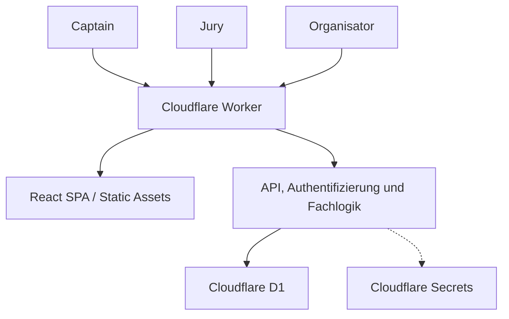

# Softwarearchitektur – Voting

Status: **Ready with explicit assumptions**  
Stand: 24. August 2026  
Gültig für: MVP der privaten Koch-Challenge

## 1. Entscheidung

Voting wird als **ein einzelner modularer Cloudflare-Worker** umgesetzt. Derselbe Worker liefert die React-Oberfläche aus und verarbeitet die API-Aufrufe. Fachliche Daten liegen ausschließlich in Cloudflare D1.

Die Anwendung wird zunächst über die von Cloudflare bereitgestellte `*.workers.dev`-Adresse getestet. Vor dem echten Einsatz werden die Testdaten zurückgesetzt. Danach wird derselbe Worker mit derselben D1-Datenbank unter **`voting.kivio.uk`** bereitgestellt.

Es gibt bewusst keine getrennten Cloudflare-Projekte für Frontend und API und keine dauerhaft getrennten Dev-/Prod-Umgebungen.

## 2. Ziele und Leitplanken

Die Architektur soll:

- den vollständigen Ablauf aus den Issues #1 bis #13 abbilden;
- auf aktuellen Smartphones schnell und ohne Installation funktionieren;
- geheime Zugänge und verborgene Zwischenstände serverseitig schützen;
- Bewertungen und Zustandswechsel konsistent speichern;
- mit sehr wenig Betriebsaufwand auskommen;
- lokal entwickelbar und automatisiert testbar sein;
- später ohne Architekturwechsel unter `voting.kivio.uk` laufen.

Nicht Bestandteil des MVP sind:

- Benutzerkonten, Passwörter, E-Mail oder externe Identitätsanbieter;
- mehrere sichtbare Challenges;
- Hintergrundjobs, Queues oder zeitgesteuerte Aktionen;
- KV, R2, Durable Objects oder weitere Datenbanken;
- externe Analytics-, Monitoring- oder Backup-Dienste;
- eine eigene Backup- oder Wiederherstellungsfunktion;
- eine getrennte Staging-Infrastruktur.

## 3. Systemkontext



Die Browser sind nicht vertrauenswürdig. Berechtigungen, Zustände, Eingabewerte und Ergebnisfreigabe werden deshalb bei jedem API-Aufruf serverseitig geprüft. Die Oberfläche unterstützt den Nutzer, ist aber keine Sicherheitsgrenze.

## 4. Technischer Zuschnitt

| Bereich | Entscheidung |
|---|---|
| Sprache | TypeScript für Client und Worker |
| Oberfläche | React als mobile-first Single Page Application |
| Build und lokale Laufzeit | Vite mit offiziellem Cloudflare-Vite-Plugin |
| Hosting | ein Cloudflare Worker mit Workers Static Assets |
| API | Worker-Routen unter `/api/*` |
| Persistenz | eine Cloudflare-D1-Datenbank, Binding `DB` |
| Konfiguration | `wrangler.jsonc`; keine produktiven Geheimnisse im Repository |
| Geheimnisse | Cloudflare Secrets `ADMIN_ACCESS_TOKEN` und `AUTH_SIGNING_SECRET` |
| Migrationen | versionierte SQL-Dateien im Repository |
| Tests | Vitest, React Testing Library und ein schlanker End-to-End-Test |
| Styling | lokale CSS-Variablen und Komponenten gemäß `docs/ui-concept.md` |
| Externe Assets | keine extern geladenen Fonts, Tracker oder UI-CDNs |

### Verantwortlichkeiten im Worker

Der Worker bleibt ein Deployment, wird im Quellcode aber in klar getrennte Module gegliedert:

- **HTTP-Schicht:** Routing, Cookies, Sicherheitsheader und einheitliche Fehlerantworten;
- **Authentifizierung:** Link-Austausch, Sessionprüfung und Rollenprüfung;
- **Anwendungslogik:** Setup, Zustandswechsel, Voting und Reveal;
- **Domänenlogik:** Invarianten, Ergebnisberechnung und Rangbildung;
- **Persistenz:** D1-Abfragen und Transaktionen;
- **DTO-Mapping:** rollen- und zustandsabhängige API-Antworten ohne interne Datenlecks.

Diese Trennung dient der Testbarkeit. Sie erzeugt keine zusätzlichen Services oder Deployments.

## 5. Zugangs- und Sicherheitsmodell

### 5.1 Geheime Links

Zugangsdaten werden im URL-Fragment übertragen, zum Beispiel:

- `https://.../#/access/admin/<token>`
- `https://.../#/access/captain/<captain-id>.<signature>`
- `https://.../#/access/jury/<jury-id>.<signature>`

Das Fragment wird beim initialen HTTP-Aufruf nicht an den Worker übertragen. Die SPA liest es aus und sendet es einmalig per `POST /api/session/exchange` an die API. Bei erfolgreicher Prüfung setzt der Worker ein signiertes Session-Cookie und entfernt anschließend das Fragment mit `history.replaceState` aus der sichtbaren URL.

### 5.2 Organisator

- `ADMIN_ACCESS_TOKEN` ist ein kryptografisch zufälliger, nur in Cloudflare gespeicherter Schlüssel.
- Der Vergleich erfolgt serverseitig und zeitkonstant.
- Der Schlüssel wird weder in D1 noch im Repository gespeichert.

### 5.3 Stimmberechtigte

Captain- und Jury-Links werden mit HMAC aus Rolle, Challenge-ID, Wähler-ID und einer Token-Version signiert. Der Schlüssel dafür ist `AUTH_SIGNING_SECRET`. Captain-Wähler verwenden weiterhin die Team-ID und das vorhandene Tokenformat; dadurch bleiben vor der Migration erzeugte Captain-Links unverändert gültig.

Dadurch:

- sind die Links praktisch nicht erratbar;
- können sie nach einem erneuten Laden identisch rekonstruiert werden;
- müssen keine Zugangstoken im Klartext gespeichert werden;
- ist keine zusätzliche Token-Tabelle erforderlich.

QR-Codes werden ausschließlich im Admin-Browser aus dem bereits geladenen persönlichen Link erzeugt. Weder Link noch Token werden an einen QR-Dienst übertragen.

Eine Sperrung oder Rotation einzelner Links bleibt entsprechend den Requirements außerhalb des MVP. Wird ein Jury-Mitglied während der Vorbereitung entfernt, ist dessen Link aufgrund der serverseitigen Wählerprüfung sofort ungültig.

### 5.4 Session

Das Session-Cookie enthält nur Sessionrolle, Wählerrolle, Challenge-ID, Wähler-ID, bei Captains zusätzlich die Team-ID, Ablaufzeit und Signatur. Sessions aus dem bisherigen Captain-Format werden weiterhin gelesen und auf das gemeinsame Wählermodell abgebildet. Empfohlene Attribute:

- `HttpOnly`
- `Secure`
- `SameSite=Strict`
- `Path=/`
- maximale Lebensdauer 30 Tage

Weitere Maßnahmen:

- Mutation nur bei passendem `Origin`;
- API-Antworten mit geschützten Daten erhalten `Cache-Control: no-store`;
- `Referrer-Policy: no-referrer`;
- Content Security Policy ausschließlich für eigene Inhalte;
- `X-Content-Type-Options: nosniff`;
- Schutz vor Einbettung über `frame-ancestors 'none'`;
- keine Tokens, Namen, Bewertungen oder Request-Bodies in normalen Logs.

## 6. Datenmodell

### 6.1 Tabellen

| Tabelle | Wesentliche Felder und Regeln |
|---|---|
| `challenges` | ID, Name, Status `preparation/running/revealed`, `revealed_at`, Zeitstempel |
| `categories` | ID, Challenge-ID, Position 1–5, Name, Leitfrage; Position und Name je Challenge eindeutig |
| `teams` | ID, Challenge-ID, Teamname, normalisierter Namensschlüssel, bisheriges Captain-Anzeigenamefeld zur abwärtskompatiblen Datenhaltung; Teamname je Challenge eindeutig |
| `voters` | ID, Challenge-ID, Rolle `captain/jury`, Anzeigename, normalisierter Name, optionale Team-ID; genau ein Captain je Team, Jury-Namen je Challenge eindeutig |
| `dinners` | ID, Challenge-ID, Team-ID, Kalenderdatum, Status `upcoming/open/closed`; genau ein Dinner je Team |
| `ballots` | ID, Dinner-ID, Wähler-ID, abwärtskompatible optionale Captain-Team-ID, Zeitstempel; Kombination aus Dinner und Wähler eindeutig |
| `ratings` | Ballot-ID, Kategorie-ID, Punktwert mit `CHECK (score BETWEEN 1 AND 5)`; Kombination aus Ballot und Kategorie eindeutig |

Alle IDs werden serverseitig als nicht erratbare UUIDs erzeugt. Kochtermine werden als lokales Kalenderdatum im Format `YYYY-MM-DD` ohne Uhrzeit gespeichert.

### 6.2 Datenbank- und Serviceregeln

Soweit möglich werden Regeln zusätzlich durch Fremdschlüssel, `UNIQUE`- und `CHECK`-Constraints geschützt.

Besonders wichtig:

- partieller eindeutiger Index auf `dinners(challenge_id)` für `status = 'open'`;
- genau ein Ballot je Wähler und Dinner;
- genau ein Rating je Ballot und Kategorie;
- eine vollständige Bewertung wird atomar geschrieben;
- Captain-Selbstbewertung, Jury-Berechtigung für jeden Abend und exakt fünf aktive Kategorien werden in der Domänenlogik geprüft;
- nach `revealed` lehnen sämtliche Mutations-Endpunkte Änderungen ab.

Es gibt keine Ergebnis-Tabelle. Ergebnisse werden nach der Auflösung aus den unveränderten Bewertungen berechnet. So können keine veralteten Ergebnisdaten entstehen.

## 7. Zustände und Invarianten

### Challenge

`preparation → running → revealed`

- Das erste Öffnen eines Dinners setzt die Challenge auf `running`.
- Ab `running` sind Teams, Captains, Jury und Kategorien gesperrt.
- `revealed` ist endgültig und macht die gesamte Challenge unveränderlich.

### Dinner

- `upcoming → open → closed`
- `closed → open` ist vor der Auflösung zum Korrigieren erlaubt.
- Es darf höchstens ein Dinner geöffnet sein.
- Ein Dinner darf erst geöffnet werden, wenn alle chronologisch früheren Dinner geschlossen sind.
- Das Datum eines bevorstehenden Dinners darf innerhalb der in Issue #3 definierten Regeln geändert werden.

Die API prüft Vorbedingungen im selben fachlichen Vorgang wie die Zustandsänderung. Der partielle eindeutige Index verhindert zusätzlich zwei gleichzeitig geöffnete Dinner bei konkurrierenden Requests.

## 8. API-Schnittstellen

Die konkrete Pfadstruktur darf bei der Umsetzung geringfügig angepasst werden. Die fachlichen Grenzen bleiben verbindlich.

### Sitzung

- `POST /api/session/exchange` – geheimen Link gegen Session austauschen
- `GET /api/session/me` – Rolle und erlaubten UI-Kontext liefern
- `POST /api/session/logout` – Session-Cookie löschen

### Organisator

- `GET /api/admin/challenge`
- `PUT /api/admin/challenge`
- `GET /api/admin/access-links`
- `GET /api/admin/captain-links`
- `POST /api/admin/dinners/:id/open`
- `POST /api/admin/dinners/:id/close`
- `POST /api/admin/dinners/:id/reopen`
- `POST /api/admin/reveal`

### Stimmberechtigte

- `GET /api/voter/dashboard`
- `GET /api/voter/dinners/:id/ballot`
- `PUT /api/voter/dinners/:id/ballot`
- `GET /api/voter/results`

Die bisherigen `/api/captain/*`-Pfade bleiben vorerst als kompatible Aliase erhalten.

### Ergebnis

- `GET /api/results`

Der Ergebnis-Endpunkt liefert vor `revealed` keine Scores. Vorherige Dashboard- und Admin-Antworten verwenden eigene DTOs, die gar keine Punktefelder enthalten. Ein bloßes Ausblenden in der Oberfläche ist nicht ausreichend.

### Fehlervertrag

Fehler werden einheitlich und ohne interne Details geliefert:

```json
{
  "error": {
    "code": "DINNER_NOT_OPEN",
    "message": "Dieser Kochabend ist nicht mehr zur Abstimmung geöffnet.",
    "fieldErrors": {}
  }
}
```

Relevante Statuscodes:

- `401` für fehlende oder ungültige Session;
- `403` für eine nicht erlaubte Rolle oder Selbstbewertung;
- `409` für Zustands- oder Parallelitätskonflikte;
- `422` für fachlich ungültige Eingaben;
- `500` für einen unerwarteten Fehler ohne technische Interna.

## 9. Kritische Abläufe

### Challenge einrichten

Challenge, fünf Kategorien, Teams und Dinner werden serverseitig validiert und in einer Transaktion gespeichert. Bei einem Fehler bleibt kein teilweise angelegtes Setup zurück.

### Dinner öffnen

Der Worker prüft Challenge-Status, Reihenfolge und vorhandene offene Dinner. Zustandsänderung und gegebenenfalls der Wechsel auf `running` erfolgen atomar. Konflikte werden mit `409` gemeldet.

### Bewertung speichern

Der Worker prüft:

1. gültige Captain- oder Jury-Session;
2. bei Captains ein fremdes kochendes Team; Jury-Mitglieder dürfen jeden Abend bewerten;
3. Dinner ist aktuell geöffnet;
4. genau fünf Ratings;
5. jede aktive Kategorie genau einmal;
6. jeder Wert liegt zwischen 1 und 5.

Ballot und Ratings werden atomar neu angelegt oder aktualisiert. Der eindeutige Schlüssel verhindert Duplikate bei Doppeltaps oder wiederholten Requests.

### Challenge auflösen

Der Worker prüft in einer Transaktion:

- alle Dinner sind geschlossen;
- kein Dinner ist offen oder bevorstehend;
- jedes Team besitzt mindestens eine vollständige Fremdbewertung;
- die Challenge wurde noch nicht aufgelöst.

Nach Bestätigung möglicher fehlender Stimmen wird `revealed` gesetzt. Ab diesem Zeitpunkt scheitern alle Mutationen.

### Ergebnisse berechnen

- Mittelwert je Team und Kategorie aus vollständigen berechtigten Bewertungen; Captain- und Jury-Stimmen haben dasselbe Gewicht;
- Gesamtscore als Mittelwert der fünf Kategorie-Scores;
- kaufmännische Rundung auf zwei Nachkommastellen für Anzeige und Rangfolge;
- gleicher gerundeter Wert bedeutet gleicher Rang;
- dichte Folgeränge, beispielsweise 1, 1, 2.

Die Berechnung ist eine reine, separat getestete Domänenfunktion.

## 10. Betrieb und Deployment

### Phasen

| Phase | Adresse und Daten |
|---|---|
| Lokal | lokale Vite-/Worker-Laufzeit mit lokaler D1-Testdatenbank |
| Einführungsphase | Cloudflare-Deployment über `*.workers.dev` mit der später weiterverwendeten D1-Datenbank |
| Go-live | Testdaten zurücksetzen, Migrationen prüfen, `voting.kivio.uk` an denselben Worker binden |
| Nutzung | keine weiteren Umgebungen; Änderungen nur mit Tests, Migration und kontrolliertem Deployment |

Nach dem Go-live kann die `workers.dev`-Adresse deaktiviert werden, sodass ausschließlich `voting.kivio.uk` verwendet wird.

### Konfiguration

`wrangler.jsonc` enthält:

- Worker-Name;
- Compatibility Date;
- Static-Assets-Konfiguration mit SPA-Fallback;
- priorisierte Worker-Ausführung für `/api/*`;
- D1-Binding `DB`;
- deklarierte Secret-Namen;
- keine Secret-Werte.

Die produktive D1-Datenbank wird mit EU-Jurisdiktion erstellt. Datenbank-ID und Domain-Bindung sind Deployment-Konfiguration, keine Fachlogik.

### Logs und Diagnose

Für den kleinen Einsatz genügen strukturierte Worker-Logs mit:

- Request-ID;
- Route und Methode;
- HTTP-Status;
- stabiler Fehlercode;
- Dauer.

Bewertungen, Token, Cookies, Namen und Request-Bodies werden nicht protokolliert. Ein externer Observability-Dienst ist nicht vorgesehen.

### Fehler und Wiederherstellung

- Ein fehlgeschlagenes Deployment wird auf die vorherige Worker-Version zurückgesetzt.
- Migrationen sind vorwärtsgerichtet und reproduzierbar.
- Schemaänderungen mit Datenrisiko erfolgen über neue Tabelle, Kopie und anschließenden Wechsel statt durch ungesicherte destruktive Änderung.
- Es wird kein eigenes Backup implementiert.
- Die von D1 bereitgestellte Time-Travel-Funktion kann im Notfall manuell genutzt werden; sie ist keine Benutzerfunktion und kein Bestandteil des normalen Ablaufs.

## 11. Implementierungsreihenfolge

1. **Foundation (#2):** Worker, React/Vite, D1-Schema, Migrationen, lokale Tests.
2. **Setup (#3):** Challenge, Kategorien, Teams und Dinner.
3. **Zugänge (#4):** Link-Austausch, Session-Cookie und serverseitige Rollenprüfung.
4. **Ablaufsteuerung (#5):** Öffnen, Schließen, Wiederöffnen und Teilnahme-Status.
5. **Captain-Flow (#6):** Dashboard und atomare Bewertung.
6. **Reveal (#7):** Freigabeprüfung, Berechnung und Ergebnisansicht.
7. **Quality Gate (#8):** Sicherheits-, Domänen- und End-to-End-Tests sowie Betriebsanleitung.
8. **Persönliche QR-Codes (#11):** lokale Darstellung für Captain- und Jury-Links.
9. **Jury (#12):** gemeinsames Wählermodell, Jury-Konfiguration und Migration bestehender Stimmen.
10. **Gesamterlebnis (#13):** neuer Standard und selektive Datenmigration der unveränderten bisherigen Kategorie.
11. **Einführungsphase:** Deployment auf `workers.dev`, manueller Abnahmelauf mit mindestens drei Teams.
12. **Go-live:** Testdaten zurücksetzen und `voting.kivio.uk` anbinden.

Issue #1 bleibt das fachliche Epic; die technische Umsetzung beginnt mit #2.

## 12. Einmalige Schritte außerhalb des Repositorys

Für das erste Cloudflare-Deployment sind manuell erforderlich:

1. D1-Datenbank mit EU-Jurisdiktion anlegen.
2. Datenbank-ID als Binding `DB` in der Cloudflare-Konfiguration hinterlegen.
3. `ADMIN_ACCESS_TOKEN` als kryptografisch zufälliges Cloudflare-Secret setzen.
4. `AUTH_SIGNING_SECRET` als unabhängiges kryptografisch zufälliges Cloudflare-Secret setzen.
5. D1-Migrationen ausführen.
6. Worker zunächst mit `workers.dev` aktivieren und deployen.
7. Vor dem echten Einsatz Testdaten zurücksetzen und den vollständigen Ablauf erneut prüfen.
8. Custom Domain `voting.kivio.uk` mit dem Worker verbinden.
9. Den geheimen Organisator-Link außerhalb des Repositorys sicher aufbewahren.

Zugangsdaten oder Secret-Werte werden weder in Issues noch im Repository dokumentiert.

## 13. Annahmen und Bedingungen für eine Neubewertung

Aktuelle Annahmen:

- eine kleine, vertraute Reisegruppe;
- eine einzelne Challenge über wenige Tage oder Wochen;
- geringe parallele Nutzung;
- ein Organisator;
- ein Datenverlust wäre ärgerlich, aber nicht geschäftskritisch.

Die Architektur sollte neu bewertet werden, wenn mehrere parallele Challenges, eine formale Identitätsprüfung, öffentliche Ergebnisse, Benachrichtigungen, langfristige Archivierung oder deutlich höhere Anforderungen an Wiederherstellung und Auditierbarkeit hinzukommen.

## 14. Verbindliche Quellen

- Produktumfang und Produktentscheidungen: [README](../README.md)
- Implementierungsanforderungen: [GitHub Issues #1–#13](https://github.com/fhacklinger-eng/voting/issues)
- UI und visuelle Leitplanken: [UI-Konzept](ui-concept.md)
- Cloudflare-Plattform:
  - [Workers Static Assets](https://developers.cloudflare.com/workers/static-assets/)
  - [Cloudflare Vite Plugin](https://developers.cloudflare.com/workers/vite-plugin/)
  - [D1 Worker API](https://developers.cloudflare.com/d1/worker-api/d1-database/)
  - [D1 Data Location](https://developers.cloudflare.com/d1/configuration/data-location/)
  - [Cloudflare Secrets](https://developers.cloudflare.com/workers/configuration/secrets/)
