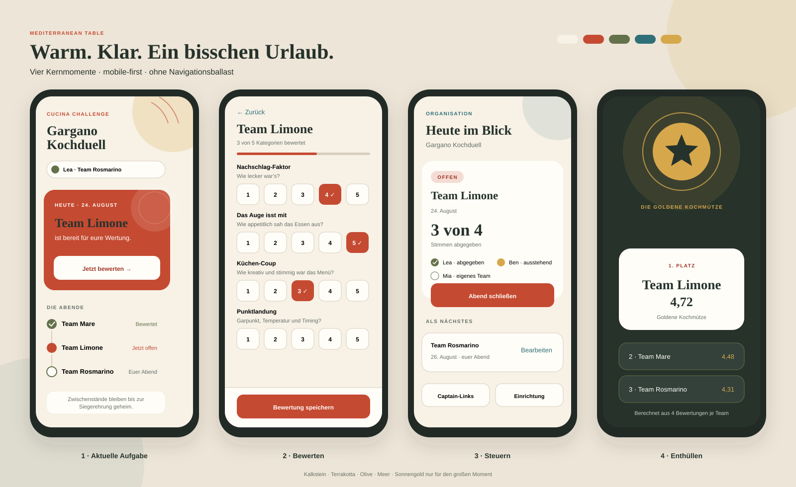

# UI-Konzept – Mediterranean Table

Status: umsetzbare Designrichtung für das MVP  
Bezug: Issues #1 bis #13
Primärer Kontext: Smartphone im Urlaub; Verwaltung und Siegerehrung zusätzlich auf größeren Bildschirmen

## 1. Empfehlung

Die Anwendung wird **mobile-first und responsiv**, nicht mobile-only.

- Captains und Jury-Mitglieder stimmen fast ausschließlich auf dem Smartphone ab. Dieser Ablauf bestimmt Struktur, Komponenten und Prioritäten.
- Der Organisator kann die Challenge ebenfalls mobil steuern, profitiert bei der einmaligen Einrichtung aber von Tablet oder Desktop.
- Die Siegerehrung soll auf einem Smartphone funktionieren und auf einem Laptop, Fernseher oder Beamer bewusst großzügiger inszeniert werden.

Die visuelle Richtung heißt **Mediterranean Table**. Sie verbindet warme Kalksteinflächen, Terrakotta, Olivgrün und einen kleinen Akzent in Meeresblau mit einer modernen, editorialen Typografie. Das Thema entsteht durch Farbe, Sprache, Rhythmus und wenige abstrahierte Motive – nicht durch Fotos, Kochmützen-Clipart oder Trattoria-Dekoration.

## 2. Nutzer, Aufgaben und Erfolg

### Captain

Kontext: direkt nach dem Essen, möglicherweise in geselliger und unruhiger Umgebung, einhändige Smartphone-Nutzung.

Kernablauf:

1. Persönlichen Link öffnen.
2. Sofort erkennen: Wer bin ich, was ist heute zu tun?
3. Fünf Bewertungen abgeben.
4. Eindeutige Speicherbestätigung erhalten.

Erfolg: fünf Entscheidungen plus einmal Speichern, keine Texteingabe, keine Navigation durch Menüs, keine sichtbaren Zwischenstände.

### Jury

Kontext und Stimmzettel entsprechen dem Captain-Ablauf. Die Jury gehört jedoch
zu keinem Team und darf jeden Kochabend bewerten. Name und Rolle müssen deshalb
auf Startseite und Stimmzettel klar erkennbar sein; der Fortschritt umfasst alle
Abende.

### Organisator

Kontext: einmalige Vorbereitung und danach jeweils eine kurze Steuerungsaktion pro Kochabend.

Kernablauf:

1. Challenge vorbereiten und persönliche Captain- und Jury-Zugänge teilen.
2. Aktuellen Abend öffnen.
3. Abgabestatus prüfen und Abend schließen.
4. Nach dem letzten Abend das Ergebnis auflösen.

Erfolg: Der nächste sinnvolle Schritt ist jederzeit sichtbar; Verwaltungsdetails konkurrieren nicht mit dem laufenden Abend.

## 3. Gestaltungsprinzipien

1. **Ein Screen, eine Hauptaufgabe.** Pro Zustand gibt es genau eine visuell dominante Aktion.
2. **Der aktuelle Abend zuerst.** Verlauf und Administration stehen unterhalb beziehungsweise hinter sekundären Aktionen.
3. **Warm, nicht verspielt.** Mediterrane Atmosphäre durch Palette und Formensprache; Humor vor allem über Texte.
4. **Keine App-Navigation für Captains.** Der persönliche Link führt auf eine zustandsabhängige Startseite; der Kontext ersetzt Tabs und Menüs.
5. **Status vor Dekoration.** Offen, erledigt, eigenes Team und geschlossen sind durch Text, Symbol und Farbe unterscheidbar.
6. **Direktes Feedback.** Auswahl, Validierung, Speichern und Zustandskonflikte werden am Ort der Aktion erklärt.
7. **Geheimhaltung ist sichtbar.** Ein kurzer Hinweis wie „Zwischenstände bleiben bis zur Siegerehrung geheim“ schafft Vertrauen, ohne das UI zu belasten.

## 4. Visuelles System

### Farbpalette

| Rolle | Token | Farbe | Verwendung |
|---|---|---:|---|
| Kalkstein | `--canvas` | `#F7F1E6` | Seitenhintergrund |
| Porzellan | `--surface` | `#FFFDF8` | Karten, Formflächen |
| Tinten-Grün | `--ink` | `#26322C` | Text, dunkle Ergebnisfläche |
| Gedämpfter Text | `--muted` | `#667066` | Hilfstexte, Metadaten |
| Terrakotta | `--primary` | `#C54A32` | primäre Aktionen, offener Abend |
| Dunkle Terrakotta | `--primary-strong` | `#9E3525` | Hover/Pressed, wichtige Labels |
| Olive | `--olive` | `#64724C` | erledigt, Erfolg, sekundäre Akzente |
| Meer | `--sea` | `#2F6F78` | Information, Links, Fokusakzent |
| Sonnengold | `--gold` | `#D6A84B` | ausschließlich Siegerehrung |
| Sandlinie | `--border` | `#D7CEBF` | dezente Trennung |

Terrakotta ist die einzige dominante Aktionsfarbe. Olive bedeutet abgeschlossen oder erfolgreich, Meeresblau Information. Sonnengold erscheint erst bei der Auflösung und behält dadurch seinen feierlichen Wert.

Die Palette wurde für gut lesbare Kombinationen ausgewählt. Kontrast, Fokusdarstellung und Zustände müssen in der implementierten Oberfläche trotzdem mit den tatsächlichen Schriftgrößen und Komponenten geprüft werden; das Konzept allein ist kein Nachweis formaler Barrierefreiheit.

### Typografie

- Überschriften: `Georgia`, `Iowan Old Style`, `Palatino` oder eine vergleichbare lokale Serifenschrift.
- Fließtext und UI: `system-ui`, `-apple-system`, `Segoe UI`, `sans-serif`.
- Keine extern geladenen Webfonts; damit bleiben Zugangslinks aus Referrern und externen Requests heraus.
- Mobile Seitentitel: 32–36 px, kompakte Zeilenhöhe.
- Abschnittstitel: 20–24 px.
- Standardtext und Formbeschriftungen: mindestens 16 px.
- Metadaten: 12–13 px, sparsam in Versalien und mit erhöhter Laufweite.

Die Serifenschrift gibt den warmen, kulinarisch-editorialen Charakter. Alle bedienrelevanten Texte bleiben in der neutralen Sans-Serif-Schrift.

### Form und Raum

- 4/8/12/16/24/32/48 px als Spacing-System.
- Kartenradius 18 px, Eingaben und Buttons 12 px, Status-Pills vollständig gerundet.
- Maximal eine leichte Schattenebene: `0 12px 32px rgba(38, 50, 44, 0.08)`.
- Dünne Sandlinien und Weißraum ersetzen verschachtelte Karten.
- Abstrahiertes Teller-/Sonnenmotiv als großer Kreis oder Halbkreis, gelegentlich ergänzt durch eine einfache Olivenblatt-Linie.
- Keine Fotohintergründe, Texturen oder dekorativen Emojis im primären Ablauf.

## 5. Informationsarchitektur

### Captain

Es gibt keine dauerhafte Navigation.

- **Startseite:** Identität, aktuelle Aufgabe, Challenge-Fortschritt.
- **Bewertung:** fünf Kategorien und Speichern.
- **Ergebnis:** erst nach Auflösung erreichbar.

Zur Bewertung führt genau eine Hauptaktion. Zurück führt zur Startseite; Browser-Zurück bleibt funktionsfähig.

### Organisator

Die Verwaltungsstartseite zeigt zuerst den laufenden Zustand. Drei sekundäre Bereiche bleiben erreichbar, aber visuell zurückgenommen:

- Challenge bearbeiten
- persönliche Zugänge teilen
- abgeschlossene und kommende Abende

Auf Mobilgeräten öffnen diese Bereiche eigene Seiten beziehungsweise fokussierte Panels. Auf Desktop können Einrichtung und Links in einer rechten Spalte oder einem seitlichen Panel erscheinen. Eine globale Seitenleiste oder ein Dashboard-Menü ist nicht notwendig.

## 6. Screen-Konzept

### 6.1 Captain-Startseite

Reihenfolge von oben nach unten:

1. Kleine Wortmarke „CUCINA CHALLENGE“ und Challenge-Name.
2. Identitäts-Pill: „Du stimmst als Lea · Team Rosmarino“. Darunter ein unaufdringlicher Link „Falscher Link?“ mit Hinweis auf den Organisator.
3. Hero-Karte für den aktuellen Zustand.
4. Chronologischer Fortschritt der Kochabende.
5. Kurzer Geheimhaltungshinweis.

Hero-Zustände:

| Zustand | Hauptaussage | Aktion |
|---|---|---|
| fremder Abend offen, noch nicht bewertet | „Heute kocht Team Limone“ | „Jetzt bewerten“ |
| fremder Abend offen, bereits bewertet | „Deine Bewertung ist gespeichert“ | „Bewertung ändern“ |
| eigenes Team kocht | „Heute seid ihr dran“ | keine; Hinweis „Die anderen stimmen ab“ |
| kein Abend offen | „Gerade gibt es nichts zu bewerten“ | keine; nächster Termin sichtbar |
| Challenge aufgelöst | „Die goldene Kochmütze ist vergeben“ | „Ergebnis ansehen“ |

Die Verlaufsliste verwendet keine austauschbaren farbigen Punkte allein:

- Haken + „Bewertet“
- Terrakotta-Pill + „Jetzt offen“
- Teller-Symbol + „Eigenes Team“
- Kalender + „Kommt noch“
- Schloss + „Geschlossen“

### 6.2 Bewertung

- Kopfbereich mit Zurück-Aktion, Teamname und Datum.
- Fortschritt als Text „3 von 5 Kategorien bewertet“ plus schmale Fortschrittslinie.
- Fünf vertikale Kategoriegruppen ohne einzelne schwere Kartenrahmen.
- Jede Gruppe enthält Titel, Leitfrage und eine zusammenhängende 1-bis-5-Auswahl.
- Bewertungswerte sind mindestens 44 × 44 px groß. Bei 320 px Viewport passen fünf Werte in eine Reihe.
- Ausgewählt: gefüllte Terrakotta-Fläche, sichtbare Zahl und zusätzlicher Haken.
- Nicht ausgewählt: Porzellanfläche, Sandlinie und dunkle Zahl.
- Unter der ersten Auswahl oder als kompakte Legende am Anfang: „1 Noch Luft im Topf · 5 Goldene Kochmütze“.
- Sticky Action Bar am unteren Rand mit „Bewertung speichern“, berücksichtigt Geräte-Safe-Area und verdeckt keinen Inhalt.
- Der Button bleibt grundsätzlich aktiv. Bei unvollständiger Auswahl führt ein Tap zur ersten fehlenden Kategorie und zeigt dort den Fehler. Dadurch bleibt der Grund eines nicht verfügbaren Abschlusses erkennbar.

Beim Bearbeiten steht im Button „Änderungen speichern“. Nach Erfolg erfolgt die Rückkehr zur Startseite mit einem persistenten Erfolgsbanner „Deine Bewertung für Team Limone ist gespeichert“.

### 6.3 Challenge einrichten

Auf dem Smartphone wird die lange Einrichtung in drei kurze Schritte gegliedert:

1. **Challenge:** Name.
2. **Teams & Termine:** wiederholbare Teamblöcke mit Team, Captain und Datum.
3. **Kategorien:** fünf vorbelegte Kategorien; Abschluss mit Zusammenfassung.

Regeln:

- Fortschritt „Schritt 2 von 3“ ist sichtbar.
- Eingaben werden beim Wechsel zwischen Schritten lokal erhalten.
- „Team hinzufügen“ folgt direkt auf die Teamliste.
- Entfernen ist eine sekundäre Textaktion und benötigt nur dann eine Bestätigung, wenn bereits Daten im Teamblock stehen.
- Die fünf Kategorien sind vorbelegt und zunächst eingeklappt; „Kategorien anpassen“ öffnet sie. So wird Konfiguration nicht zur Pflichtaufgabe.
- Auf Desktop erscheinen Challenge/Teams links und Kategorien/Zusammenfassung rechts; Reihenfolge und Benennung bleiben identisch.

Nach erfolgreichem Speichern landet der Organisator nicht in einem generischen Dashboard, sondern bei „Persönliche Zugänge teilen“ als nächstem notwendigen Schritt.

### 6.4 Persönliche Zugänge

- Pro Captain und Jury-Mitglied eine kompakte Karte mit Name, ausgeschriebener Rolle beziehungsweise Team und primärer Aktion „Teilen“.
- Auf Smartphones steht die Identität in einer eigenen Zeile über den klar zugeordneten Aktionen „Teilen“ und „QR-Code“; ab Tabletbreite darf die Karte wieder einzeilig werden.
- Wenn Web Share verfügbar ist, öffnet „Teilen“ den nativen Share-Dialog; andernfalls wird der Link kopiert.
- Nach Kopieren: inline „Link kopiert“ statt flüchtiger Meldung ohne Kontext.
- Die sekundäre Aktion „QR-Code“ öffnet genau einen Dialog mit großem, lokal im Browser erzeugtem QR-Code.
- Der Dialog nennt Name und Rolle beziehungsweise Team, warnt vor der Weitergabe und schließt per Schaltfläche, Klick außerhalb oder Escape. Danach kehrt der Tastaturfokus zum Auslöser zurück.
- Falls die QR-Darstellung scheitert, bleibt „Link kopieren“ als direkte Alternative verfügbar.
- Der geheime Token wird nicht vollständig als Text dargestellt.
- Ein kurzer Hinweis erklärt: „Jeder Link gehört genau zu einer Person.“

### 6.5 Organisator-Startseite

Oberste Karte: aktueller beziehungsweise nächster Kochabend.

Offener Abend:

- Team und Datum
- „3 von 4 Stimmen“ als große Statuszahl
- kurze Liste mit Haken, Uhr und „nicht stimmberechtigt“
- primäre Aktion „Abend schließen“

Bei fehlenden Stimmen öffnet sich ein kompaktes Bestätigungs-Panel:

> Zwei Stimmen fehlen: Lea und Ben. Sie können nach dem Schließen nicht mehr abstimmen, außer du öffnest den Abend erneut.

Aktionen: „Weiter offen lassen“ und „Trotzdem schließen“.

Unterhalb folgen kommende und abgeschlossene Abende als ruhige Liste. „Challenge bearbeiten“ und „Zugänge“ sind sekundäre Text-/Outline-Aktionen im Kopfbereich.

### 6.6 Ergebnis und Siegerehrung

Die Auflösung erhält als einziger Bereich einen bewussten Szenenwechsel:

- dunkler Tinten-Grün-Hintergrund;
- Sonnengold nur für Medaille, Rang und Akzentlinie;
- große Serifentitel;
- Kategorie-Sieger zunächst als horizontale Karten beziehungsweise mobil als vertikale Liste;
- zentrale Aktion „Gesamtsieger enthüllen“.

Nach dem Enthüllen:

- Platz 1 als große Porzellan-Karte mit goldener Teller-/Sonnenform;
- weitere Teams in klarer Rangliste;
- geteilter Rang wird sprachlich benannt, nicht nur durch doppelte Zahl;
- bei fehlenden Stimmen erscheint sachlich „Berechnet aus 3 von 4 möglichen Bewertungen“.

Eine kurze Aufblendbewegung von 300–500 ms ist erlaubt. Bei reduzierter Bewegung erscheinen Inhalte ohne Translation oder Konfetti. Es gibt keine automatische Tonwiedergabe und kein endloses Feuerwerk.

## 7. Komponenten und Zustände

### Primärbutton

- Höhe mindestens 52 px, volle Breite auf Mobilgeräten.
- Terrakotta mit weißer Beschriftung; pressed in dunkler Terrakotta.
- Fokus als deutlich sichtbarer doppelter Ring aus Porzellan und Meeresblau.
- Ladezustand behält Breite und Beschriftungskontext, beispielsweise „Wird gespeichert …“.
- Bei Request-Lauf ist nur die konkrete Aktion gegen Doppeltap gesperrt.

### Rating-Gruppe

- Semantisch eine beschriftete Radio-Gruppe.
- Pfeiltasten beziehungsweise Tab/Space folgen dem gewählten Web-Pattern konsistent.
- Screenreader-Name kombiniert Kategorie, Wert und Skalenbedeutung.
- Fehlertext steht direkt unter der Gruppe und wird programmatisch zugeordnet.

### Status-Pill

- Immer Symbol + Text; Farbe unterstützt nur.
- `Offen`: Terrakotta.
- `Bewertet/erledigt`: Olive.
- `Information`: Meer.
- `Bevorstehend/eigenes Team`: neutrale Porzellanfläche mit dunkler Kontur.

### Banner und Fehler

- Erfolg: Olive-Linie, Haken, konkrete gespeicherte Aktion.
- Validierung: am Feld, Fokus springt nur nach fehlgeschlagenem Absenden zur ersten Fehlerstelle.
- Netzwerkfehler: Eingabe bleibt stehen; Aktion „Erneut versuchen“.
- Zustandskonflikt: „Der Abend wurde inzwischen geschlossen. Deine Auswahl wurde nicht gespeichert.“ Danach „Status aktualisieren“.
- Ungültiger Link: neutrale Seite mit „Dieser Einladungslink ist nicht gültig. Bitte frag euren Organisator nach dem aktuellen Link.“ Keine Daten der Challenge anzeigen.
- Skeletons nur für kurze erwartbare Ladezeiten; nach längerer Verzögerung Klartext und Wiederholen-Aktion.

## 8. Responsive Verhalten

| Bereich | Smartphone | Tablet/Desktop |
|---|---|---|
| Captain-Start | eine Spalte, Hero zuerst | max. 560 px, bewusst kompakt statt gestreckt |
| Bewertung | eine kompakte Spalte, sticky Fortschritt und Speichern | bis zwei kompakte Spalten, konsistente Breite der Rating-Gruppen |
| Einrichtung | drei sequenzielle Schritte | zweispaltig mit persistenter Zusammenfassung |
| Verwaltung | Karten und aufklappbare Statuslisten | Hauptzustand links, Übersicht/Links rechts |
| Ergebnis | vertikale Gewinnerkarten | Kategorieübersicht und Rangliste bis max. 1100 px |

Breakpoints folgen dem tatsächlichen Platzbedarf der Komponenten, nicht bestimmten Gerätemodellen. Der Kernablauf muss bei 320 px ohne horizontales Scrollen funktionieren und bei Textvergrößerung sinnvoll umbrechen.

## 9. UX-relevante Akzeptanzchecks

- Ein Captain erkennt innerhalb des ersten Screens seinen Namen, sein Team und die aktuelle Aufgabe.
- Eine neue Bewertung erfordert genau fünf Auswahlhandlungen und einmal Speichern.
- Keine Captain-Funktion erfordert Texteingabe oder ein Menü.
- Der aktuelle Kochabend und die primäre Aktion stehen bei üblichen Smartphone-Höhen vor der Verlaufsliste.
- Jede Bewertungszahl besitzt eine Touchfläche von mindestens 44 × 44 px.
- Auswahl, Status und Fehler sind ohne Farbwahrnehmung verständlich.
- Alle Aktionen sind mit Tastatur erreichbar; Fokusreihenfolge und sichtbarer Fokus folgen der visuellen Reihenfolge.
- Bei 320 px Breite entstehen weder horizontales Scrollen noch überlagerte Bedienelemente.
- Bei Textvergrößerung bleiben Inhalt und Aktionen erreichbar; Sticky-Elemente verdecken keine Fehlermeldungen.
- Ein Speicherfehler, ein zwischenzeitlich geschlossener Abend und ein ungültiger Link haben jeweils einen konkreten Wiederherstellungsweg.
- Vor der Auflösung deutet kein visuelles Element einen Score oder Trend an.
- Bei reduzierter Bewegung bleibt die Ergebnisdarstellung vollständig verständlich.
- Es werden keine externen Schriften, Fotos oder Tracking-Ressourcen geladen.

Diese Checks ergänzen die fachlichen Akzeptanzkriterien. Eine formale Accessibility-Aussage erfordert später Code-Review, Kontrastmessung, Tastatur- und Screenreader-Tests in der implementierten Anwendung.

## 10. Zuordnung zu den Issues

| Issue | Relevanter Teil des UI-Konzepts |
|---|---|
| #2 | Design-Tokens, responsive Anwendungsschale, Statusmodell |
| #3 | dreistufige Einrichtung, vorbelegte eingeklappte Kategorien |
| #4 | Identitäts-Pill, Captain-Links, ungültiger Link |
| #5 | Organisator-Startseite, Statusliste, Schließen/Wiederöffnen |
| #6 | Captain-Startseite, Rating-Komponente, Speicher- und Fehlerzustände |
| #7 | zweistufige Siegerehrung, Rangliste und Gleichstände |
| #8 | Responsive-, Browser-, Tastatur-, Fokus- und Fehlerprüfungen |
| #15 | lesbare persönliche Zugänge, kompakter Stimmzettel, neutrale Ausgangs- und gezielte Fehlerzustände |

## 11. Bewusste Nicht-Elemente

- keine Bottom-Navigation für Captains;
- kein Hamburger-Menü;
- kein allgemeines Dashboard mit Kennzahlen;
- keine Food-Fotos oder generischen KI-Bilder;
- keine frei wählbaren Themes;
- keine Gamification vor der Auflösung;
- keine Animation, die eine Abstimmung verlangsamt;
- keine Icons ohne verständliche Textbeschriftung;
- keine permanent sichtbaren geheimen URLs.

## 12. Validierung

Vor der Implementierung reicht ein sehr kleiner Prototypentest mit zwei bis drei Mitreisenden:

1. Persönlichen Link öffnen und erklären lassen, wer sie sind und was als Nächstes zu tun ist.
2. Einen Kochabend bewerten, ohne Hilfe oder Vorwissen.
3. Eine Bewertung ändern.
4. Als Organisator einen Abend mit einer fehlenden Stimme schließen.
5. Ergebnis auf einem Smartphone und einem größeren Bildschirm enthüllen.

Beobachtet werden nur Kernsignale: Wird die Hauptaktion gefunden, wird die 1-bis-5-Skala richtig verstanden, entstehen Fehlbedienungen und bleibt die Auflösung spannend? Zusätzliche Funktionen werden daraus nur abgeleitet, wenn sie ein tatsächlich beobachtetes Problem lösen.
